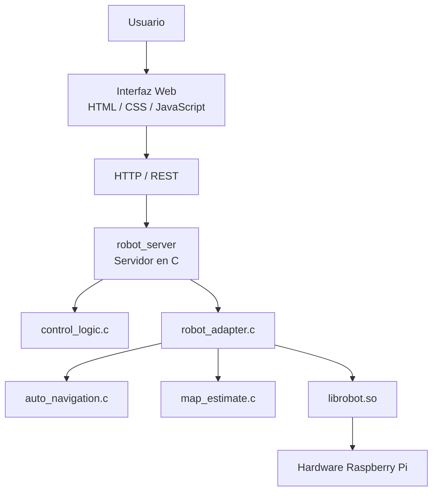
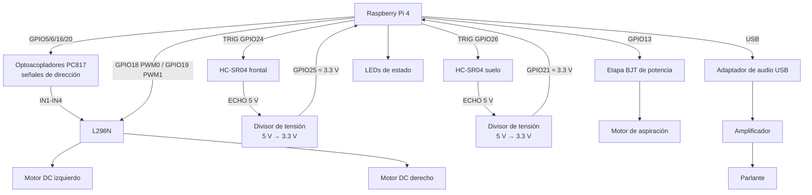

# RumBa — Robot Aspiradora con Raspberry Pi 4

Proyecto de **Sistemas Empotrados** desarrollado sobre una **Raspberry Pi 4 Model B**. RumBa integra control de motores, sensores ultrasónicos, aspiración, indicadores, audio, navegación autónoma, una API REST y una interfaz web dentro de una imagen Linux construida con **Yocto Project / Poky 5.0.19 (Scarthgap)**.

## Integrantes

- Christian Navarro Ellerbrock
- Mauricio Luna Acuña
- Jorge Gutiérrez Vindas
- Mauro Navarro Obando

---

## 1. Descripción general

El proyecto implementa un robot aspiradora móvil con dos modos principales:

- **Manual:** el usuario controla el desplazamiento desde la interfaz web.
- **Automático:** el robot utiliza las lecturas de los sensores para avanzar, detectar obstáculos, detenerse y buscar una nueva dirección.

Las funciones principales del sistema son:

- control diferencial de dos motores DC;
- regulación independiente de velocidad mediante PWM;
- puente H L298N;
- sensor HC-SR04 frontal;
- segundo HC-SR04 orientado al suelo;
- protección de movimiento ante condiciones inseguras del sensor de suelo;
- aspiración controlada independientemente;
- cuatro LEDs de estado;
- reproducción de canciones MP3;
- avisos WAV para eventos del robot;
- audio mediante adaptador USB;
- servidor HTTP/REST desarrollado en C;
- autenticación y sesiones;
- persistencia mediante SQLite;
- derivación de contraseñas mediante OpenSSL/scrypt;
- navegación autónoma reactiva;
- mapa estimado del recorrido;
- interfaz web responsive;
- biblioteca dinámica `librobot.so`;
- compilación cruzada mediante el SDK de Poky;
- integración final mediante una capa propia de Yocto: `meta-robot/`;
- arranque automático mediante `systemd`;
- conexión Wi-Fi automática;
- comprobación de hardware antes de iniciar el servidor;
- herramientas propias para medir arranque, rootfs, RAM y CPU.

La versión de `develop` revisada para esta documentación contiene la capa `meta-robot/` y la imagen final `rumba-complete-image`.

---

# 2. Arquitectura del sistema

## 2.1 Arquitectura de software

El software está organizado por capas. El servidor y la interfaz no manipulan directamente GPIO o PWM; el acceso físico se concentra en la biblioteca dinámica `librobot`.



Flujo principal:

```text
Usuario
   ↓
Interfaz web
   ↓
HTTP / REST
   ↓
server.c
   ↓
robot_adapter.c / control_logic.c / auto_navigation.c
   ↓
librobot.so
   ↓
GPIO / PWM / sensores / motores / aspiración / audio
```

Esta separación permite probar las capas superiores con dobles o simulación y modificar el hardware sin acoplarlo directamente al servidor HTTP.

---

## 2.2 Arquitectura de hardware



> **Seguridad eléctrica:** `ECHO` del HC-SR04 trabaja a aproximadamente 5 V y no debe conectarse directamente a un GPIO de la Raspberry Pi. Ambos sensores deben utilizar adaptación a aproximadamente 3.3 V.

La Raspberry Pi utiliza su propia alimentación de 5 V. La etapa de potencia de motores y aspiración debe dimensionarse según sus cargas y no debe alimentarse desde un GPIO.

---

# 3. Asignación de GPIO

La configuración del hardware se encuentra centralizada en:

```text
lib/src/hardware_config.h
```

La copia integrada en la receta Yocto se encuentra en:

```text
meta-robot/recipes-robot/librobot/files/librobot/src/hardware_config.h
```

Actualmente ambas configuraciones utilizan:

| Función | GPIO BCM |
|---|---:|
| Motor izquierdo IN1 | 5 |
| Motor izquierdo IN2 | 6 |
| Motor izquierdo PWM / ENA | 18 |
| Motor derecho IN1 | 16 |
| Motor derecho IN2 | 20 |
| Motor derecho PWM / ENB | 19 |
| HC-SR04 frontal TRIG | 24 |
| HC-SR04 frontal ECHO | 25 |
| HC-SR04 suelo TRIG | 26 |
| HC-SR04 suelo ECHO | 21 |
| Aspiración | 13 |
| LED encendido | 17 |
| LED automático | 27 |
| LED manual | 22 |
| LED obstáculo | 23 |

El control de velocidad utiliza:

```text
/sys/class/pwm/pwmchip0
```

con:

```text
PWM0 / canal 0 → motor izquierdo
PWM1 / canal 1 → motor derecho
Periodo         → 1 000 000 ns = 1 kHz
```

Los jumpers de `ENA` y `ENB` del L298N deben retirarse cuando la velocidad se controla externamente mediante PWM.

---

# 4. Estructura del repositorio

```text
Rumba-Empotrados/
│
├── lib/
│   ├── include/robot_hw.h
│   ├── src/
│   ├── sounds/
│   ├── tests/
│   ├── tools/
│   └── CMakeLists.txt
│
├── navigation/
│   ├── include/
│   ├── src/
│   ├── tests/
│   └── CMakeLists.txt
│
├── server/
│   ├── include/
│   ├── src/
│   ├── tests/
│   └── CMakeLists.txt
│
├── web/
│   └── www/
│       ├── index.html
│       ├── css/
│       └── js/
│
└── meta-robot/
    ├── conf/
    │   └── layer.conf
    │
    ├── recipes-core/
    │   ├── busybox/
    │   └── images/
    │       ├── rpi-test-image.bbappend
    │       └── rumba-complete-image.bb
    │
    ├── recipes-kernel/
    │   └── linux/
    │
    └── recipes-robot/
        ├── librobot/
        ├── robot-server/
        ├── robot-startup/
        └── robot-metrics/
```

## Nota sobre las fuentes usadas por Yocto

Las recetas actuales utilizan copias versionadas mediante `file://`:

```text
meta-robot/recipes-robot/librobot/files/librobot/
meta-robot/recipes-robot/robot-server/files/server/
```

Por lo tanto, antes de generar la imagen final se debe comprobar que estas copias correspondan a la versión deseada de `lib/` y `server/`.

---

# 5. Biblioteca dinámica `librobot`

`librobot.so` abstrae el hardware del robot. La API pública se encuentra en:

```text
lib/include/robot_hw.h
```

## 5.1 Códigos de retorno

```c
typedef enum
{
    ROBOT_OK = 0,
    ROBOT_ERROR = -1,
    ROBOT_INVALID_ARGUMENT = -2,
    ROBOT_NOT_INITIALIZED = -3
} RobotStatus;
```

---

## 5.2 Inicialización

### `robot_init`

```c
int robot_init(void);
```

Inicializa los recursos requeridos por la biblioteca.

### `robot_cleanup`

```c
void robot_cleanup(void);
```

Libera los recursos de hardware utilizados por la biblioteca.

---

## 5.3 Motores

### Velocidades independientes

```c
int robot_set_motor_speeds(int left_speed, int right_speed);
```

Rango lógico:

```text
-100 ... 100
```

- positivo: adelante;
- negativo: atrás;
- `0`: detenido.

Ejemplo:

```c
robot_set_motor_speeds(60, 60);
```

### Operaciones de alto nivel

```c
int robot_move_forward(int speed);
int robot_move_backward(int speed);
int robot_turn_left(int speed);
int robot_turn_right(int speed);
int robot_stop(void);
```

---

## 5.4 Aspiración

```c
int robot_suction_set(int enabled);
int robot_suction_get(void);
```

Uso:

```text
0 → apagada
1 → encendida
```

La aspiración es independiente de los motores de tracción.

---

## 5.5 Sensores

```c
#define ROBOT_SENSOR_ERROR (-1.0f)

float robot_get_front_distance(void);
float robot_get_floor_distance(void);
```

Las distancias se expresan en centímetros.

Una lectura inválida devuelve `ROBOT_SENSOR_ERROR` y no debe convertirse en una condición de seguridad válida.

Los HC-SR04 utilizan:

- pulso `TRIG` de aproximadamente 10 µs;
- detección de flancos de `ECHO`;
- timeout de 30 ms;
- rango aceptado de 2 a 400 cm;
- separación mínima de 65 ms entre disparos.

---

## 5.6 LEDs

```c
typedef enum
{
    ROBOT_LED_POWER = 0,
    ROBOT_LED_AUTONOMOUS,
    ROBOT_LED_MANUAL,
    ROBOT_LED_OBSTACLE
} RobotLed;

int robot_led_set(RobotLed led, int state);
```

`state`:

```text
0 → apagado
1 → encendido
```

---

## 5.7 Audio

```c
int robot_audio_play(const char *filename);
int robot_audio_pause(void);
int robot_audio_stop(void);
int robot_audio_set_volume(int volume);
const char *robot_audio_get_state(void);
```

Avisos:

```c
typedef enum
{
    ROBOT_ALERT_START = 0,
    ROBOT_ALERT_MANUAL,
    ROBOT_ALERT_AUTOMATIC,
    ROBOT_ALERT_OBSTACLE,
    ROBOT_ALERT_CYCLE_END
} RobotAudioAlert;

int robot_audio_alert(RobotAudioAlert alert);
```

La biblioteca utiliza:

- `mpg123` para canciones MP3;
- `aplay`/ALSA para avisos WAV;
- adaptador de sonido USB;
- volumen lógico de `0` a `100`;
- volumen inicial de software `75`.

Los avisos disponibles en la imagen son:

```text
inicio.wav
manual.wav
automatico.wav
obstaculo.wav
fin_ciclo.wav
```

---

# 6. Audio USB y PWM de motores

El proyecto utiliza GPIO18 y GPIO19 como canales PWM de hardware:

```text
GPIO18 → PWM0
GPIO19 → PWM1
```

Para no depender del audio analógico integrado y mantener esos recursos disponibles para los motores, el robot utiliza un **adaptador de audio USB**:

```text
Raspberry Pi
    ↓ USB
Adaptador de sonido USB
    ↓
Amplificador
    ↓
Parlante
```

En el arranque, `robot-preflight` comprueba que la tarjeta USB esté disponible y fija el volumen de hardware mediante `amixer`.

---

# 7. Servidor REST

El servidor está implementado en C y escucha por defecto en el puerto:

```text
8080
```

Ruta del ejecutable en la imagen:

```text
/home/root/robot_server
```

Base de datos:

```text
/home/root/robot.db
```

Catálogo de música:

```text
/home/root/music/
```

El servidor utiliza:

- `SQLite3` para usuarios, sesiones y catálogo de canciones;
- `OpenSSL` para `scrypt`, generación aleatoria y manejo de tokens;
- `librobot.so` para todo acceso físico.

---

## 7.1 API HTTP principal

Salvo `status`, `register` y `login`, las rutas requieren:

```text
Authorization: Bearer TOKEN
```

| Método | Ruta | Función |
|---|---|---|
| `GET` | `/api/status` | Estado básico del servidor |
| `POST` | `/api/auth/register` | Registrar usuario |
| `POST` | `/api/auth/login` | Iniciar sesión |
| `POST` | `/api/auth/logout` | Cerrar sesión |
| `GET` | `/api/profile` | Obtener perfil |
| `GET` | `/api/mode` | Consultar modo y navegación |
| `PUT` | `/api/mode` | Cambiar manual/automático y opcionalmente duración |
| `GET` | `/api/motors` | Consultar velocidades configuradas |
| `PUT` | `/api/motors` | Configurar velocidades izquierda/derecha |
| `GET` | `/api/sensors` | Consultar sensor frontal y sensor de suelo |
| `GET` | `/api/indicators` | Consultar estado e indicador de obstáculo |
| `POST` | `/api/move` | Movimiento manual o parada |
| `GET` | `/api/suction` | Consultar aspiración |
| `PUT` | `/api/suction` | Encender/apagar aspiración |
| `GET` | `/api/map` | Obtener mapa estimado |
| `GET` | `/api/audio/songs` | Lista de canciones |
| `GET` | `/api/audio/state` | Estado de audio |
| `POST` | `/api/audio/play` | Reproducir canción |
| `POST` | `/api/audio/pause` | Pausar |
| `POST` | `/api/audio/stop` | Detener audio |
| `POST` | `/api/audio/next` | Siguiente canción |
| `PUT` | `/api/audio/volume` | Ajustar volumen |

---

# 8. Modos de operación y seguridad de movimiento

## 8.1 Manual

En modo manual el usuario envía órdenes de desplazamiento desde la interfaz.

El servidor permite:

```text
forward
backward
left
right
stop
```

El sensor de suelo continúa actuando como protección: si `floor_guard` determina que el movimiento no es seguro, el servidor detiene/rechaza el movimiento con `floor_safety_blocked`.

---

## 8.2 Automático

El modo automático ejecuta una navegación reactiva:

```text
avance
→ obstáculo
→ parada
→ giro
→ búsqueda de espacio libre
→ confirmación
→ nuevo avance
```

La navegación utiliza además la condición del sensor de suelo. Ante una condición insegura se detiene el movimiento y puede pausarse el estado automático.

El modo automático permite definir una duración mediante:

```json
{
  "mode": "automatic",
  "duration_seconds": 60
}
```

`duration_seconds = 0` representa un ciclo sin límite temporal.

---

# 9. Mapa del recorrido

El mapa es una **estimación del recorrido**, no un sistema de localización absoluta.

El robot no posee encoders de rueda. La estimación se basa en:

```text
órdenes de movimiento
+ velocidades configuradas
+ tiempo transcurrido
```

Por ello pueden acumularse errores debido a:

- diferencias entre motores;
- deslizamiento;
- irregularidades del suelo;
- duración de los giros;
- variaciones de velocidad.

El mapa no garantiza una posición exacta ni cobertura completa del ambiente.

---

# 10. Requisitos del host de desarrollo

Se recomienda Ubuntu/Linux con las herramientas necesarias para CMake y Yocto.

Para compilar el software en el host:

```bash
sudo apt update
sudo apt install -y \
    build-essential \
    cmake \
    pkg-config \
    git \
    libgpiod-dev \
    libsqlite3-dev \
    libssl-dev
```

Para un entorno Yocto estándar también se requieren las dependencias indicadas por Yocto Project para Scarthgap, por ejemplo:

```bash
sudo apt install -y \
    gawk wget git diffstat unzip texinfo gcc build-essential \
    chrpath socat cpio python3 python3-pip python3-pexpect \
    xz-utils debianutils iputils-ping python3-git \
    python3-jinja2 python3-subunit zstd liblz4-tool \
    file locales
```

---

# 11. Clonar el proyecto

```bash
git clone https://github.com/Chris-0307/Rumba-Empotrados.git
cd Rumba-Empotrados
git checkout develop
```

Para una entrega reproducible se recomienda utilizar un tag final:

```bash
git checkout <TAG_DE_ENTREGA>
```

---

# 12. Compilación nativa para pruebas

## 12.1 Biblioteca

```bash
cmake -S lib -B build-lib
cmake --build build-lib
```

## 12.2 Servidor sin hardware

```bash
cmake -S server -B build-host \
    -DROBOT_WITH_HARDWARE=OFF

cmake --build build-host
```

Ejecutar:

```bash
ROBOT_SIMULATE=1 \
./build-host/robot_server robot.db 8080
```

Comprobar:

```bash
curl http://127.0.0.1:8080/api/status
```

Respuesta esperada:

```json
{"status":"ok"}
```

---

# 13. Compilación cruzada con el SDK de Poky

Durante el desarrollo se utilizó un SDK de Poky 5.0.19.

Ejemplo de activación:

```bash
source /opt/poky/5.0.19-rumba/environment-setup-cortexa7t2hf-neon-vfpv4-poky-linux-gnueabi
```

## 13.1 `librobot`

```bash
cmake -S lib -B build-arm-lib \
    -DCMAKE_TOOLCHAIN_FILE="$OE_CMAKE_TOOLCHAIN_FILE"

cmake --build build-arm-lib
```

Verificar:

```bash
file build-arm-lib/librobot.so.1.0.0
```

## 13.2 Servidor

```bash
cmake -S server -B build-arm-server \
    -DROBOT_WITH_HARDWARE=ON \
    -DCMAKE_TOOLCHAIN_FILE="$OE_CMAKE_TOOLCHAIN_FILE"

cmake --build build-arm-server
```

Verificar dependencias:

```bash
file build-arm-server/robot_server
$READELF -d build-arm-server/robot_server | grep NEEDED
```

El enlace debe incluir `librobot.so.1`, SQLite y OpenSSL según corresponda.

---

# 14. Evidencia de compilación cruzada mediante SDK

Los artefactos de compilación cruzada conservados en el repositorio muestran el uso del toolchain de Poky:

```text
CMAKE_C_COMPILER =
/opt/poky/5.0.19-rumba/sysroots/x86_64-pokysdk-linux/usr/bin/
arm-poky-linux-gnueabi/arm-poky-linux-gnueabi-gcc

CMAKE_TOOLCHAIN_FILE =
/opt/poky/5.0.19-rumba/sysroots/x86_64-pokysdk-linux/usr/share/cmake/
OEToolchainConfig.cmake
```

También utilizan un sysroot ARM:

```text
cortexa7t2hf-neon-vfpv4-poky-linux-gnueabi
```

Esto evidencia que los binarios no fueron compilados con el compilador nativo x86-64 del host.

---

# 15. Capa propia de Yocto: `meta-robot`

La capa ya se encuentra integrada en `develop`:

```text
meta-robot/
```

Su `layer.conf` declara compatibilidad con:

```bitbake
LAYERSERIES_COMPAT_meta-robot = "scarthgap"
```

La capa contiene cuatro componentes principales:

| Receta | Función |
|---|---|
| `librobot_1.0.bb` | Compila e instala `librobot.so` |
| `robot-server_1.0.bb` | Compila e instala `robot_server`, `robot.db` y música |
| `robot-startup_1.0.bb` | Wi-Fi, preflight y `robot.service` |
| `robot-metrics_1.0.bb` | Herramientas de métricas y medición del arranque |

La imagen final se define en:

```text
meta-robot/recipes-core/images/rumba-complete-image.bb
```

Su contenido principal es:

```bitbake
SUMMARY = "Imagen RumBa con herramientas de medicion integradas"

require recipes-core/images/rpi-test-image.bb

IMAGE_INSTALL:append = " librobot robot-startup robot-metrics"
```

`robot-startup` depende de `robot-server`, por lo que el servidor también se incorpora a la imagen.

> `rumba-complete-image` extiende la receta base `rpi-test-image.bb`. El entorno Yocto usado para construir el proyecto debe contener la capa que proporciona dicha receta.

---

# 16. Agregar `meta-robot/` al entorno Yocto

Entrar al entorno de construcción:

```bash
cd /RUTA/AL/ENTORNO/YOCTO
source poky/oe-init-build-env build
```

Agregar la capa:

```bash
bitbake-layers add-layer \
    /RUTA/Rumba-Empotrados/meta-robot
```

Verificar:

```bash
bitbake-layers show-layers
```

También conviene verificar que la imagen base exista:

```bash
bitbake-layers show-recipes rpi-test-image
```

y que las recetas del proyecto estén disponibles:

```bash
bitbake-layers show-recipes | grep -E \
'librobot|robot-server|robot-startup|robot-metrics|rumba-complete-image'
```

Para Raspberry Pi debe configurarse la máquina correspondiente en `conf/local.conf`, por ejemplo:

```bitbake
MACHINE = "raspberrypi4"
```

El entorno probado utilizó **Poky 5.0.19 (Scarthgap)**.

---

# 17. Recetas propias `.bb`

## 17.1 `librobot_1.0.bb`

Ruta:

```text
meta-robot/recipes-robot/librobot/librobot_1.0.bb
```

Resumen de la receta:

```bitbake
SUMMARY = "Biblioteca de hardware RumBa, sensores, motores, aspiracion y audio"
LICENSE = "CLOSED"

SRC_URI = "file://librobot"
S = "${WORKDIR}/librobot"

inherit cmake pkgconfig

DEPENDS = "libgpiod"
RDEPENDS:${PN} += "libgpiod mpg123 alsa-utils-aplay"

FILES:${PN} += "${datadir}/robot/sounds"
```

---

## 17.2 `robot-server_1.0.bb`

Ruta:

```text
meta-robot/recipes-robot/robot-server/robot-server_1.0.bb
```

Dependencias:

```bitbake
DEPENDS = "librobot openssl sqlite3"
RDEPENDS:${PN} += "librobot"
```

Instala:

```text
/home/root/robot_server
/home/root/robot.db
/home/root/music/
```

La receta impide generar una imagen con una base de datos vacía.

---

## 17.3 `robot-startup_1.0.bb`

Ruta:

```text
meta-robot/recipes-robot/robot-startup/robot-startup_1.0.bb
```

Integra:

```text
robot.service
robot-wifi.service
robot-preflight
robot-hw-check
robot.env
wpa_supplicant.conf
systemd-networkd
```

---

## 17.4 `robot-metrics_1.0.bb`

Ruta:

```text
meta-robot/recipes-robot/robot-metrics/robot-metrics_1.0.bb
```

Instala:

```text
/usr/bin/robot-medir-arranque
/usr/bin/robot-medir-recursos
/usr/bin/robot-resumir-recursos
robot-boot-metrics.service
```

---

# 18. Generación de la imagen Yocto

Con el entorno de BitBake activado:

```bash
bitbake rumba-complete-image 2>&1 | tee ~/rumba-complete-image-build.log
```

Los artefactos se generan bajo:

```text
tmp/deploy/images/raspberrypi4/
```

Para localizarlos:

```bash
find tmp/deploy/images/raspberrypi4 \
    -maxdepth 1 \
    -name 'rumba-complete-image*' \
    -print
```

---

# 19. Evidencia del log de compilación Yocto

La compilación automatizada de las recetas deja logs dentro de `tmp/work`.

Para `librobot`:

```bash
find tmp/work -path '*librobot*/temp/log.do_compile'
```

Para `robot-server`:

```bash
find tmp/work -path '*robot-server*/temp/log.do_compile'
```

Guardar evidencia:

```bash
mkdir -p docs/evidencias

cp "$(find tmp/work -path '*librobot*/temp/log.do_compile' | head -1)" \
   docs/evidencias/librobot-log.do_compile
```

Extraer las líneas que evidencian el compilador cruzado:

```bash
grep -E \
'arm-poky-linux|--sysroot|cortexa7' \
docs/evidencias/librobot-log.do_compile | head -20
```

El fragmento entregado debe provenir del **build final** y debe mostrar el compilador/sysroot del target.

> En esta versión del README no se inventa un fragmento de `log.do_compile`: debe copiarse el generado por BitBake en la construcción final.

---

# 20. Flashear la imagen

Primero identificar la microSD:

```bash
lsblk
```

Si la imagen generada es `.wic.bz2`, puede escribirse con:

```bash
bzcat rumba-complete-image-raspberrypi4.rootfs.wic.bz2 | \
sudo dd of=/dev/sdX bs=4M status=progress conv=fsync
```

Si el build genera un archivo `.bmap`, también puede utilizarse `bmaptool`.

> **Advertencia:** verificar `/dev/sdX` antes de escribir la imagen.

---

# 21. Configuración de la imagen

## 21.1 Wi-Fi

La configuración usada por el robot se instala como:

```text
/etc/robot/wpa_supplicant.conf
```

Su fuente dentro de la capa es:

```text
meta-robot/recipes-robot/robot-startup/files/wpa_supplicant.conf
```

No se deben publicar credenciales reales en documentación pública.

`robot-wifi.service`:

1. desbloquea Wi-Fi mediante `rfkill`;
2. levanta `wlan0`;
3. ejecuta `wpa_supplicant`;
4. utiliza `systemd-networkd` para obtener IPv4 mediante DHCP.

Comprobar:

```bash
systemctl status robot-wifi.service
ip -4 addr show wlan0
```

---

## 21.2 Variables del robot

Archivo:

```text
/etc/robot/robot.env
```

Valores definidos en la configuración actual:

```bash
ROBOT_FLOOR_MAX_CM=6
ROBOT_AUTO_SPEED=30
ROBOT_AUTO_TURN_SPEED=25
ROBOT_AUTO_TURN_TIMEOUT_MS=6000
ROBOT_AUDIO_DEVICE='plughw:CARD=Device,DEV=0'
ROBOT_ALERTS_DIR=/usr/share/robot/sounds
ROBOT_ALLOWED_ORIGIN='http://localhost:5500'
```

---

# 22. Arranque automático con `systemd`

El servidor se ejecuta mediante:

```text
robot.service
```

Comandos:

```bash
systemctl status robot.service
systemctl restart robot.service
journalctl -u robot.service
```

La unidad utiliza:

```text
ExecStartPre=/usr/libexec/robot/robot-preflight
ExecStart=/home/root/robot_server /home/root/robot.db 8080
Restart=on-failure
RestartSec=3s
```

Antes de permitir que el servidor arranque, `robot-preflight` comprueba:

- existencia de `robot_server`;
- existencia de `librobot.so.1`;
- conexión Wi-Fi con IPv4;
- `/dev/gpiochip0`;
- al menos dos canales PWM;
- tarjeta de audio USB;
- `aplay`;
- `mpg123`;
- avisos WAV;
- inicialización de `librobot`;
- orden de parada de motores;
- aspiración apagada;
- lectura inicial de sensores.

El preflight fija además el volumen de hardware USB antes de iniciar el servidor.

---

# 23. Uso de la interfaz web

La interfaz se encuentra en:

```text
web/www/
```

En una PC conectada a la misma red:

```bash
cd web/www
python3 -m http.server 5500 --bind 127.0.0.1
```

Abrir:

```text
http://localhost:5500/
```

En la pantalla de conexión indicar:

```text
IP    → IP de la Raspberry Pi
Puerto → 8080
```

El origen `http://localhost:5500` coincide con la configuración actual de `ROBOT_ALLOWED_ORIGIN`.

---

# 24. Uso básico de la API

## 24.1 Estado

```bash
API=http://IP_RASPBERRY:8080

curl "$API/api/status"
```

Respuesta:

```json
{"status":"ok"}
```

---

## 24.2 Registrar usuario

```bash
curl -X POST "$API/api/auth/register" \
    -H 'Content-Type: application/json' \
    -d '{"username":"usuario","password":"clave-segura-123"}'
```

La contraseña debe tener entre 12 y 120 caracteres.

---

## 24.3 Login

```bash
curl -X POST "$API/api/auth/login" \
    -H 'Content-Type: application/json' \
    -d '{"username":"usuario","password":"clave-segura-123"}'
```

Guardar el token:

```bash
TOKEN="TOKEN_RECIBIDO"
```

---

## 24.4 Modo manual

```bash
curl -X PUT "$API/api/mode" \
    -H "Authorization: Bearer $TOKEN" \
    -H 'Content-Type: application/json' \
    -d '{"mode":"manual"}'
```

---

## 24.5 Modo automático

Sin límite:

```bash
curl -X PUT "$API/api/mode" \
    -H "Authorization: Bearer $TOKEN" \
    -H 'Content-Type: application/json' \
    -d '{"mode":"automatic"}'
```

Por 60 segundos:

```bash
curl -X PUT "$API/api/mode" \
    -H "Authorization: Bearer $TOKEN" \
    -H 'Content-Type: application/json' \
    -d '{"mode":"automatic","duration_seconds":60}'
```

---

## 24.6 Velocidades independientes

```bash
curl -X PUT "$API/api/motors" \
    -H "Authorization: Bearer $TOKEN" \
    -H 'Content-Type: application/json' \
    -d '{"left_speed":40,"right_speed":60}'
```

---

## 24.7 Movimiento

```bash
curl -X POST "$API/api/move" \
    -H "Authorization: Bearer $TOKEN" \
    -H 'Content-Type: application/json' \
    -d '{"direction":"forward"}'
```

Parada:

```bash
curl -X POST "$API/api/move" \
    -H "Authorization: Bearer $TOKEN" \
    -H 'Content-Type: application/json' \
    -d '{"direction":"stop"}'
```

---

## 24.8 Aspiración

Encender:

```bash
curl -X PUT "$API/api/suction" \
    -H "Authorization: Bearer $TOKEN" \
    -H 'Content-Type: application/json' \
    -d '{"action":"on"}'
```

Apagar:

```bash
curl -X PUT "$API/api/suction" \
    -H "Authorization: Bearer $TOKEN" \
    -H 'Content-Type: application/json' \
    -d '{"action":"off"}'
```

---

# 25. Pruebas del proyecto

El repositorio incluye pruebas de diferentes capas.

Servidor:

```text
server/tests/control_logic_test.c
server/tests/floor_guard_test.c
server/tests/auto_navigation_test.c
server/tests/floor_adapter_test.c
server/tests/map_motors_test.c
```

Navegación:

```text
navigation/tests/test_navigation_map.c
navigation/tests/test_obstacle_avoidance.c
navigation/tests/test_reactive_coverage.c
navigation/tests/test_route_map.c
```

Biblioteca:

```text
lib/tests/alerts_test.c
lib/tests/suction_test.c
```

Entre los comportamientos cubiertos se encuentran:

- inicialización y cambio de modo;
- fallos simulados del hardware;
- parada;
- detección de borde;
- lecturas inválidas;
- antigüedad de muestras;
- enclavamiento de seguridad;
- navegación automática;
- timeout de giro;
- aspiración;
- avisos de audio;
- mapa estimado;
- movimiento diferencial.

Para la entrega es recomendable guardar la salida de la ejecución de las pruebas en:

```text
docs/evidencias/pruebas.txt
```

---

# 26. Herramientas de métricas integradas

La imagen final incluye herramientas propias mediante la receta:

```text
meta-robot/recipes-robot/robot-metrics/robot-metrics_1.0.bb
```

Herramientas:

```text
robot-medir-arranque
robot-medir-recursos
robot-resumir-recursos
```

Además se habilita:

```text
robot-boot-metrics.service
```

---

## 26.1 Medición del arranque

`robot-medir-arranque` se inicia automáticamente en cada boot y espera la primera respuesta satisfactoria de:

```text
http://127.0.0.1:8080/api/status
```

El resultado queda en:

```text
/run/robot-metrics/arranque.txt
```

Consultar:

```bash
cat /run/robot-metrics/arranque.txt
```

El método utiliza `/proc/uptime`, por lo que mide desde el inicio del kernel y **no incluye firmware ni bootloader**.

---

## 26.2 Medición de CPU y RAM

Ejemplo de una prueba de 120 muestras:

```bash
robot-medir-recursos 120 /tmp/rumba-prueba2
```

Genera:

```text
/tmp/rumba-prueba2/contexto.txt
/tmp/rumba-prueba2/recursos.csv
```

Resumir:

```bash
robot-resumir-recursos \
    /tmp/rumba-prueba2/recursos.csv
```

El método utiliza:

- `/proc/stat` para CPU;
- `/proc/meminfo` para RAM;
- `du -x -sk /` para contenido del rootfs;
- `df -k` para capacidad de particiones;
- `systemctl` para estado de servicios;
- `ps` para procesos activos.

---

# 27. Resultados reales de métricas

Las siguientes mediciones se obtuvieron en la Raspberry Pi ejecutando:

```text
Poky 5.0.19 (Scarthgap)
Linux 6.6.63-v7l
ARMv7l
```

Durante la medición de recursos se tomaron **120 muestras** durante aproximadamente **120.46 s**. En el contexto registrado aparecen activos `robot_server` y `mpg123`, además de los servicios del sistema del robot.

## 27.1 Resumen

| Métrica | Resultado | Presupuesto / referencia | Estado |
|---|---:|---:|---|
| Rootfs ocupado | **142.264 MB** (135.674 MiB) | 200 MB | **Cumple** |
| API operativa desde inicio del kernel | **8.63 s** | 15 s | **Cumple** |
| RAM promedio | **105.78 MiB** | 200 MB nominales | **Cumple** |
| RAM máxima | **106.49 MiB** | 200 MB nominales | **Cumple** |
| CPU global promedio | **1.13 %** | Informativo | Bajo |
| CPU máxima muestreada | **3.20 %** | Informativo | Bajo |
| Muestras | **120** | — | — |
| Duración observada | **≈120.46 s** | — | — |

---

## 27.2 Tamaño del rootfs

El script ejecutó:

```bash
du -x -sk /
```

Resultado:

```text
rootfs_KiB=138930
rootfs_MB=142.264
rootfs_MiB=135.674
```

La partición raíz reportó:

```text
Filesystem   1K-blocks   Used   Available   Use%
/dev/root       263049  147469      97374    60%
```

Para evaluar el tamaño del software se utiliza el contenido calculado mediante `du`, no la capacidad total de la partición.

Respecto al presupuesto de 200 MB:

```text
200.000 MB - 142.264 MB = 57.736 MB de margen
```

**Resultado: cumple.**

---

## 27.3 Tiempo de arranque

Evidencia obtenida automáticamente:

```text
boot_id=de8a5283-04d6-4e0c-add4-7b70a962269e
api_operativa_desde_inicio_kernel_s=8.63
sondeo_iniciado_desde_kernel_s=3.61
metodo=primera respuesta HTTP exitosa con status=ok en localhost:8080/api/status
limite=excluye firmware y bootloader; sondeo cada 1 s mas duracion de peticion
NRestarts=0
ActiveState=active
SubState=running
```

Interpretación:

- el servicio de medición comenzó a sondear a los **3.61 s**;
- la API respondió correctamente a los **8.63 s** desde el inicio del kernel;
- `robot.service` estaba `active/running`;
- el servicio no había reiniciado: `NRestarts=0`.

Respecto al presupuesto de 15 s:

```text
15.00 s - 8.63 s = 6.37 s de margen
```

**Resultado: cumple.**

> La cifra de 8.63 s no incluye el tiempo del firmware ni del bootloader.

---

## 27.4 RAM

A partir de las 120 muestras:

```text
RAM promedio = 105.78 MiB
RAM máxima   = 106.49 MiB
RAM mínima   = 105.15 MiB
RAM total    = 1867.71 MiB
```

El consumo máximo observado se mantiene ampliamente por debajo del presupuesto nominal de 200 MB.

**Resultado: cumple.**

---

## 27.5 CPU

La CPU se calculó utilizando la diferencia entre contadores consecutivos de `/proc/stat`.

Resultado de las 120 muestras:

```text
CPU global promedio   = 1.13 %
CPU máxima muestreada = 3.20 %
```

El consumo observado durante la prueba fue bajo y no mostró saturación de la Raspberry Pi.

---

# 28. Evidencia de ejecución en el target

La captura de contexto de la medición confirmó la ejecución sobre:

```text
Linux raspberrypi4 6.6.63-v7l ... armv7l GNU/Linux
Poky (Yocto Project Reference Distro) 5.0.19 (scarthgap)
```

Los servicios consultados por `robot-medir-recursos` aparecieron activos:

```text
robot.service             → active
robot-wifi.service        → active
systemd-networkd.service  → active
```

También se observaron procesos reales del proyecto:

```text
/home/root/robot_server /home/root/robot.db 8080

/usr/bin/mpg123 -R -o alsa \
    -a plughw:CARD=Device,DEV=0 \
    -m -f 32768
```

Al finalizar la medición:

```text
NRestarts=0
ActiveState=active
SubState=running
```

Esto evidencia que el servidor y el subsistema de audio permanecieron operativos durante la prueba.

---

# 29. Guardar las evidencias

Se recomienda crear:

```text
docs/evidencias/
```

y conservar:

```text
docs/evidencias/
├── arranque-prueba2.txt
├── contexto.txt
├── recursos.csv
├── librobot-log.do_compile
├── robot-server-log.do_compile
└── pruebas.txt
```

Copiar desde la Raspberry:

```bash
mkdir -p docs/evidencias

scp root@IP_RASPBERRY:/run/robot-metrics/arranque.txt \
    docs/evidencias/arranque-prueba2.txt

scp root@IP_RASPBERRY:/tmp/rumba-prueba2/contexto.txt \
    docs/evidencias/contexto.txt

scp root@IP_RASPBERRY:/tmp/rumba-prueba2/recursos.csv \
    docs/evidencias/recursos.csv
```

---

# 30. Resultados principales del proyecto

| Componente | Resultado |
|---|---|
| Sistema operativo | Poky 5.0.19 / Scarthgap ejecutándose en Raspberry Pi 4 |
| Arquitectura target | ARMv7l |
| Biblioteca dinámica | `librobot.so` |
| Motores | Control diferencial mediante L298N y PWM |
| Sensores | HC-SR04 frontal y HC-SR04 de suelo |
| Protección de suelo | Implementada con validación de muestras y bloqueo |
| Navegación | Autónoma reactiva con evasión de obstáculos |
| Aspiración | Control independiente mediante GPIO13 |
| Indicadores | Cuatro LEDs de estado |
| Audio | MP3 + avisos WAV mediante adaptador USB |
| Servidor | API REST en C, puerto 8080 |
| Persistencia | SQLite |
| Autenticación | OpenSSL/scrypt + tokens |
| Interfaz | Web responsive |
| Mapa | Estimación del recorrido sin encoders |
| Yocto | Capa propia `meta-robot/` integrada en `develop` |
| Imagen final | `rumba-complete-image` |
| Arranque automático | `robot.service` |
| Wi-Fi automático | `robot-wifi.service` + `systemd-networkd` |
| Preflight | GPIO, PWM, Wi-Fi, audio, biblioteca y sensores |
| Rootfs | 142.264 MB |
| API operativa | 8.63 s desde inicio del kernel |
| RAM | 105.78 MiB promedio; 106.49 MiB máximo |
| CPU | 1.13 % promedio; 3.20 % máximo |

---

# 31. Seguridad y preflight

Antes de mover el robot se deben comprobar:

1. alimentación correcta de la Raspberry Pi;
2. alimentación adecuada de motores y actuadores;
3. adaptación de `ECHO` de ambos HC-SR04 a 3.3 V;
4. conexiones del L298N;
5. ausencia de jumpers `ENA/ENB` si se usa PWM externo;
6. optoacopladores correctamente conectados;
7. aspiración apagada durante las pruebas iniciales;
8. disponibilidad del sensor de suelo;
9. funcionamiento de la parada.

La imagen final automatiza parte de estas comprobaciones mediante:

```text
/usr/libexec/robot/robot-preflight
```

Si falta Wi-Fi, GPIO, PWM, audio o la biblioteca no puede inicializarse correctamente, `robot.service` no debe iniciar el servidor normalmente.

---

# 32. Limitaciones conocidas

- El mapa es una estimación y no dispone de encoders.
- La localización acumula error con el tiempo.
- El HC-SR04 depende de la geometría y reflectividad acústica del obstáculo.
- El L298N presenta mayores pérdidas que controladores modernos.
- La API HTTP está pensada para una red local confiable.
- El servidor no debe exponerse directamente a Internet sin TLS y medidas adicionales.
- Las recetas actuales de Yocto contienen copias locales de `lib/` y `server/`; deben mantenerse sincronizadas con el código raíz.
- `rumba-complete-image` depende de la receta base `rpi-test-image.bb`, que debe estar disponible en el entorno Yocto usado por el curso.

---

# 33. Reproducibilidad

Para una entrega final se recomienda crear un tag:

```bash
git status
git rev-parse HEAD

git tag -a v1.0-entrega -m "Entrega final RumBa"
git push origin v1.0-entrega
```

Las evidencias de compilación, ejecución y métricas deben corresponder al mismo commit/tag.

También se debe conservar:

```text
rumba-complete-image-build.log
log.do_compile de librobot
log.do_compile de robot-server
arranque.txt
contexto.txt
recursos.csv
```

---


# 35. Referencias internas del repositorio

- [`lib/include/robot_hw.h`](lib/include/robot_hw.h) — API pública de `librobot`.
- [`lib/src/hardware_config.h`](lib/src/hardware_config.h) — asignación de hardware.
- [`lib/README.md`](lib/README.md) — documentación histórica de la biblioteca.
- [`server/README.md`](server/README.md) — documentación del servidor.
- [`server/src/server.c`](server/src/server.c) — implementación de la API REST.
- [`web/www/`](web/www/) — interfaz web.
- [`meta-robot/conf/layer.conf`](meta-robot/conf/layer.conf) — definición de la capa.
- [`meta-robot/recipes-core/images/rumba-complete-image.bb`](meta-robot/recipes-core/images/rumba-complete-image.bb) — imagen final.
- [`meta-robot/recipes-robot/librobot/librobot_1.0.bb`](meta-robot/recipes-robot/librobot/librobot_1.0.bb) — receta de biblioteca.
- [`meta-robot/recipes-robot/robot-server/robot-server_1.0.bb`](meta-robot/recipes-robot/robot-server/robot-server_1.0.bb) — receta del servidor.
- [`meta-robot/recipes-robot/robot-startup/robot-startup_1.0.bb`](meta-robot/recipes-robot/robot-startup/robot-startup_1.0.bb) — integración de arranque y red.
- [`meta-robot/recipes-robot/robot-metrics/robot-metrics_1.0.bb`](meta-robot/recipes-robot/robot-metrics/robot-metrics_1.0.bb) — herramientas de métricas.

---

## Instituto Tecnológico de Costa Rica

**Escuela de Ingeniería en Computadores**  
**Sistemas Empotrados — Proyecto RumBa**
